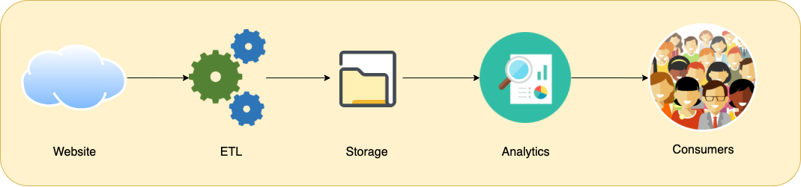
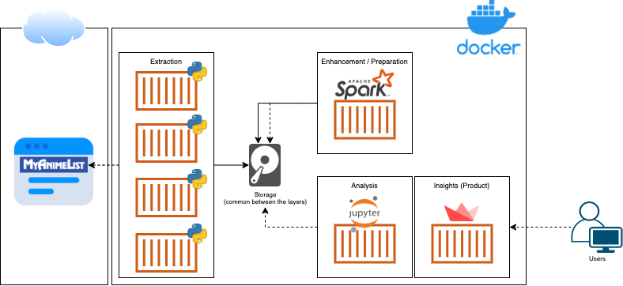

# myanimelist-data-collector

Special thanks to this **AMAZING** website! 

[](https://myanimelist.net/)

## Intro

This project relies on the famous and trusted online anime database myanimelist.net. It's a **complete**, well-architected and easy-to-use website that allows us, fans of animes/mangas, to navigate through our favorite Asian arts.

Its community is huge and engaged, participating in sharing reviews, applying ratings, and discussing the tv shows and HQs.

Trusting in the website and its community/forum, we manage to scrape the data of anime/manga profiles to build a rich dataset to analyze, tell stories and recommend new series for you to watch, based on your favorite styles and series you've watched before.

Take a look into the macro view of the project!



## Architecture



## ETL

### Extraction: Web scrap job

***Important:*** *Remember to interval the extractions to do not badly influence other users' experiences while navigating the website. Thank you!* 

Run it as a normal python job, passing the start and end 'anime ID' as arguments:

```
$ python3 code/python/data-collector.py -s 1 -e 50000
```

This job will collect the data from HTML through web scrap using the library [BeautifulSoup4](https://pypi.org/project/beautifulsoup4/) and persist as json files in the raw data layer.

### Transform and Load job

Run it as a normal python job

```
$ python3 code/python/data-transformer.py
```

This job will read all json files, transforming in a single dataframe using [Pandas](https://pandas.pydata.org/pandas-docs/stable/index.html), enhancing the data and finally saving it as a parquet file in the enhanced data layer.

## Services (Data App and Sandbox)

### Data App

### Sandbox