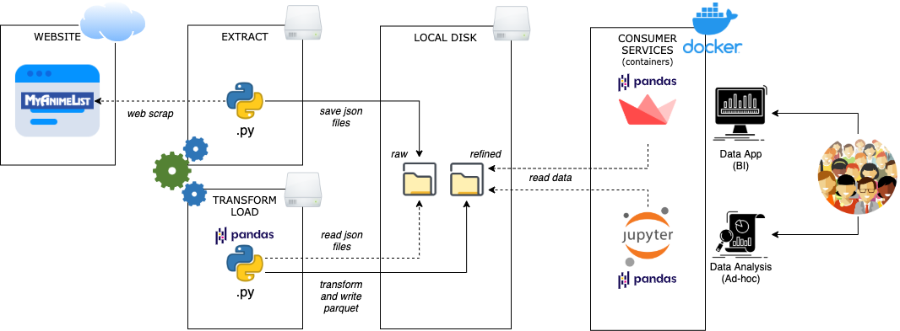

# myanimelist-data-collector

Special thanks to this **AMAZING** website! 

[](https://myanimelist.net/)

## Intro

This project relies on the famous and trusted online anime database myanimelist.net. It's a **complete**, well-architected and easy-to-use website that allows us, fans of animes/mangas, to navigate through our favorite Asian arts.

Its community is huge and engaged, participating in sharing reviews, applying ratings, and discussing the tv shows and HQs.

Trusting in the website and its community/forum, we manage to scrape the data of anime/manga profiles to build a rich dataset to analyze, tell stories and recommend new series for you to watch, based on your favorite styles and series you've watched before.

Embark into the architecture of this project:



## Analysis


To start the analysis on your own, you'll need to have a Docker instance installed and running in your PC.

Once it's ready:
1) start the docker-compose
    ```
    $ docker-compose up -d
    ```
2) run & copy the token from the logs:
    ```
    $ docker logs jupy
    ```
3) open your favorite browser and type:
    ```
    htttp://localhost:10000
    ```
4) choose a notebook or create one for yourself and start the analysis


## Web scrap job (data extraction)


### Anime

|Data|Status|
|-|-|
|Titles|OK|
|Synopsis|OK|
|Information|OK|
|Statistics|OK|
|Characters' Data|Pending|
|Voice Actors' Data|Pending|
|Episodes' Data|Pending|

### Manga

|Data|Status|
|-|-|
|Titles|Pending|
|Synopsis|Pending|
|Information|Pending|
|Statistics|Pending|
|Characters' Data|Pending|
|Charpters' Data|Pending|


***Important:*** *Remember to interval the extractions to do not badly influence other users' experiences while navigating the website. Thank you!* 

This job can be executed directly in your workstation or as a container.

To run it locally, you just need to run it as a normal python job, passing the start and end ID as arguments:

```

$ python3 code/python/data-collector.py -s 1 -e 50000

```

To run it as a container, you'll need to have a Docker instance installed and running on your PC.

The steps are:

1) build the docker image
    ```
    $ docker build -t mal-data-collector:latest -f devops/Dockerfile.DataCollector
    ```
2) start the docker-compose
    ```
    $ docker-compose up -d
    ```