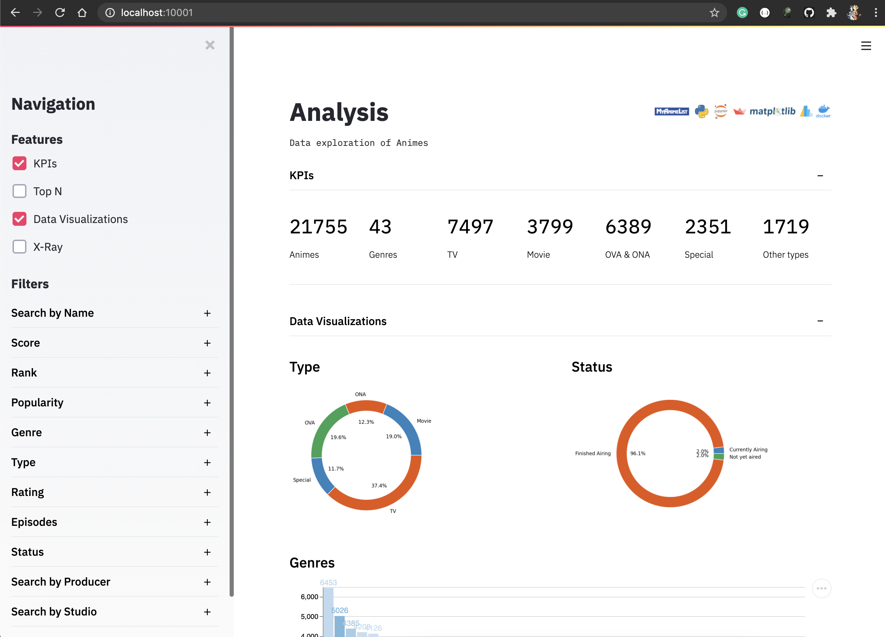

# myanimelist-data-collector

Special thanks to this **AMAZING** website! 

[](https://myanimelist.net/)

## Intro

This project relies on the famous and trusted online anime database myanimelist.net. It's a **complete**, well-architected and easy-to-use website that allows us, fans of animes/mangas, to navigate through our favorite Asian arts.

Its community is huge and engaged, participating in sharing reviews, applying ratings, and discussing the tv shows and HQs.

Trusting in the website and its community/forum, we manage to scrape the data of anime/manga profiles to build a rich dataset to analyze, tell stories and recommend new series for you to watch, based on your favorite styles and series you've watched before.

Take a look into the macro view of the project!


## Architecture


## ETL

### Extraction: Web scrap job

***Important:*** *Remember to interval the extractions to do not badly influence other users' experiences while navigating the website. Thank you!* 

Run it as a normal python job, passing the start and end 'anime ID' as arguments:

```
$ python3 code/python/data-collector.py -s 1 -e 50000
```

This job will collect the data from HTML through web scrap using the library [BeautifulSoup4](https://pypi.org/project/beautifulsoup4/) and persist as json files in the raw data layer.

### Transform and Load job

Run it as a normal python job

```
$ python3 code/python/data-transformer.py
```

This job will read all json files, transforming in a single dataframe using [Pandas](https://pandas.pydata.org/pandas-docs/stable/index.html), enhancing the data and finally saving it as a parquet file in the enhanced data layer.

## Services (Data App and Sandbox)

We're gonna **light them up** by using a Docker stack. As simple as this:

1) build the image for the Data App
```
$ myanimelist-data-collector % docker build -t anime-data-app:latest -f code/data-app/Dockerfile .
```
2) once the image is available, we can execute our two containers with Docker compose:
```
$ myanimelist-data-collector % cd devops
$ devops % docker-compose up -d
Creating network "jupyterNetwork" with driver "bridge"
Creating anime-app ... done
Creating jupy      ... done
```

### Data App (BI)

**Access:** http://localhost:10001/


As you can see in the left panel, you can turn on the features and apply filters to the datasets. For example:



The concept of the features are:
- KPI: core metrics
- TOP N: exploring the data by ordering them and selecting the most relevant
- Data Visualizations: visual data analysis
- X-Ray: deep dive into a single anime title

### Sandbox (Ad-hoc)

**Access:** http://localhost:10000/


Oops, you need to login here. Let's get this opportunity to install some dependencies too :)

Access the terminal of the container 'jupy' and install some requirements. Once its done, check its log and get the token to access the Jupyter.


Now you're good to go 


3) to turn off the containers, you can use this:
```
$ devops % docker-compose down
Stopping anime-app ... done
Stopping jupy      ... done
Removing anime-app ... done
Removing jupy      ... done
Removing network jupyterNetwork
```